<h2>寵物餐廳 專題</h2>

<h2>主題：</h2>
設計一個寵物餐廳預約系統，顧客可以註冊登入先預約想要的餐點及到達的時間和想要認識及認養的貓狗或是自帶的寵物，可避免餐點久候並提高餐廳的換桌率。

1. 背景與動機
背景： 寵物餐廳藉由營利為目的，實際上是幫助浪浪可以找到回家的路。
動機：在餐廳點餐有時會花很多時間在看菜單，等點完之後上菜又很費時，事先把餐點選好可節省等餐的時間。

2. 目標與需求
目標：
1. 結合官網設立一個預約訂餐系統。

需求：
- 註冊、登入會員並保存會員驗證狀態。
- CRUD 功能：顧客可查詢菜單，店家可維護菜單項目。
- 訂單管理：記錄每筆訂單，支持訂單狀態更新與歷史查詢。
  

<h2> 技術還不純熟的技術</h2> 

HTML5	PHP Figma  jQuery	 Bootstrap	AJAX	CSS	JavaScript  MySQL  Vue 3	
		
		
		

	
		
   
   
   <h1>作品</h1>
   
 <h2>前端介面</h2>
   
   

 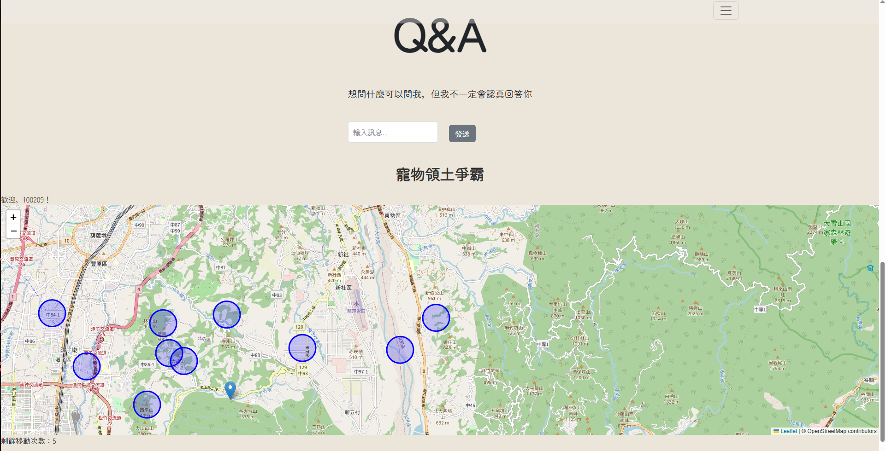

      
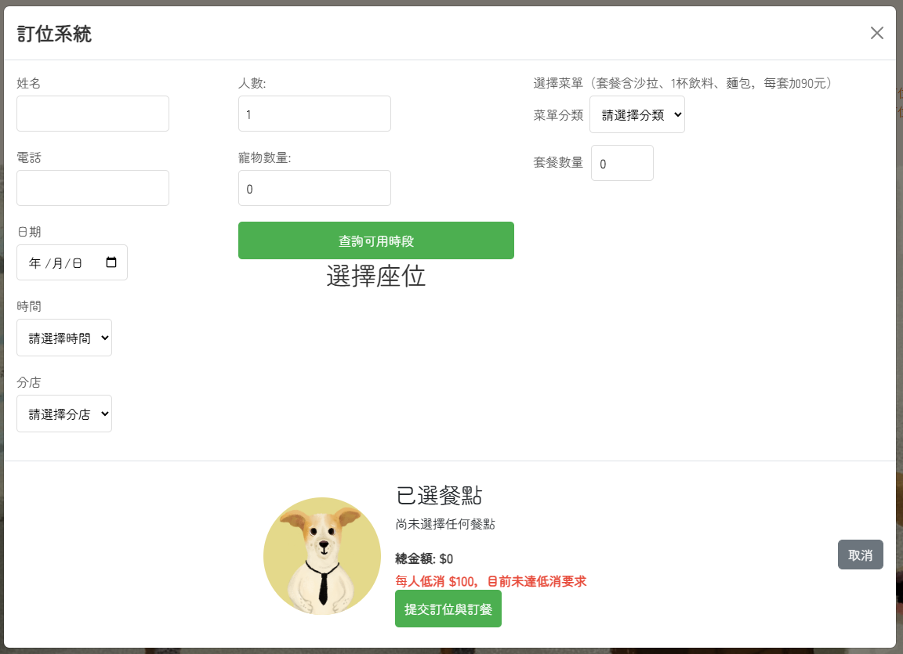

   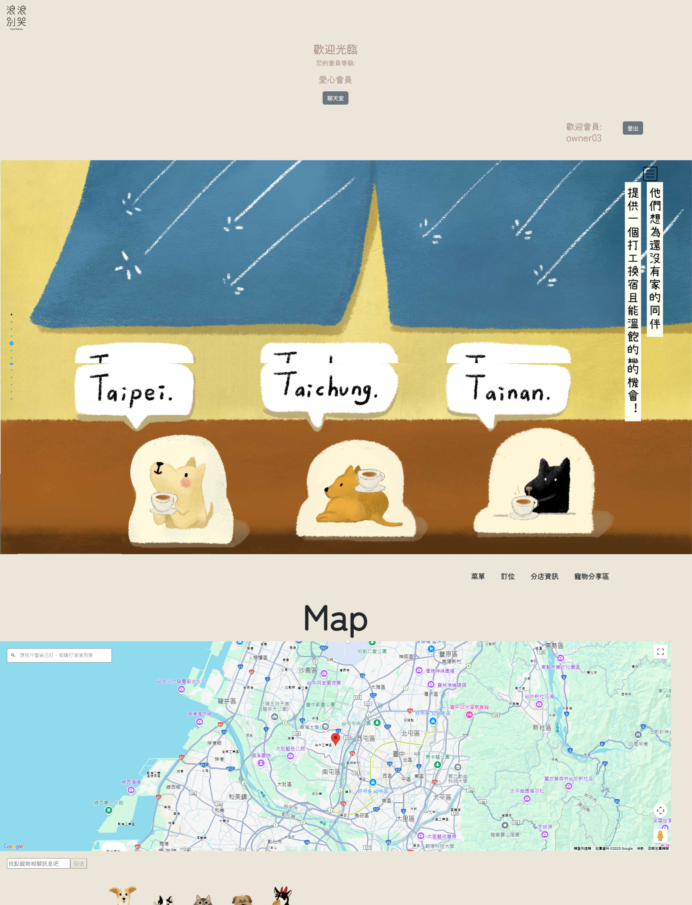

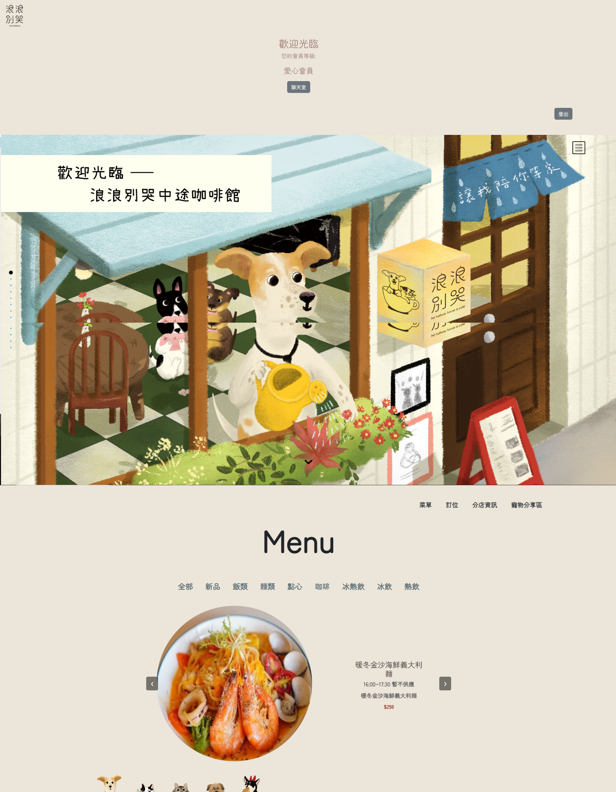

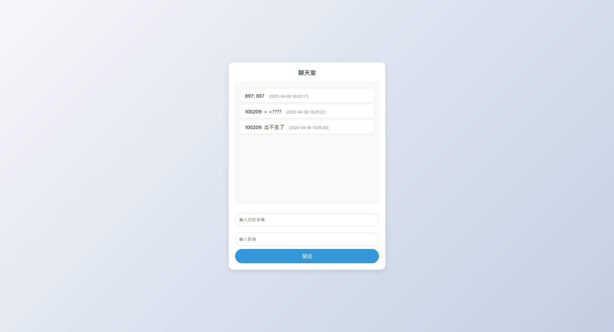

 

 

 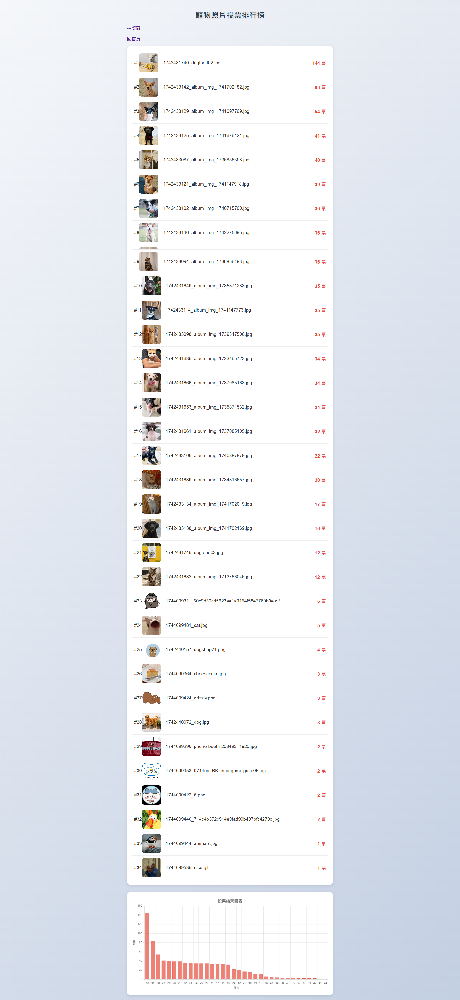

 <h2>後臺管理介面</h2>

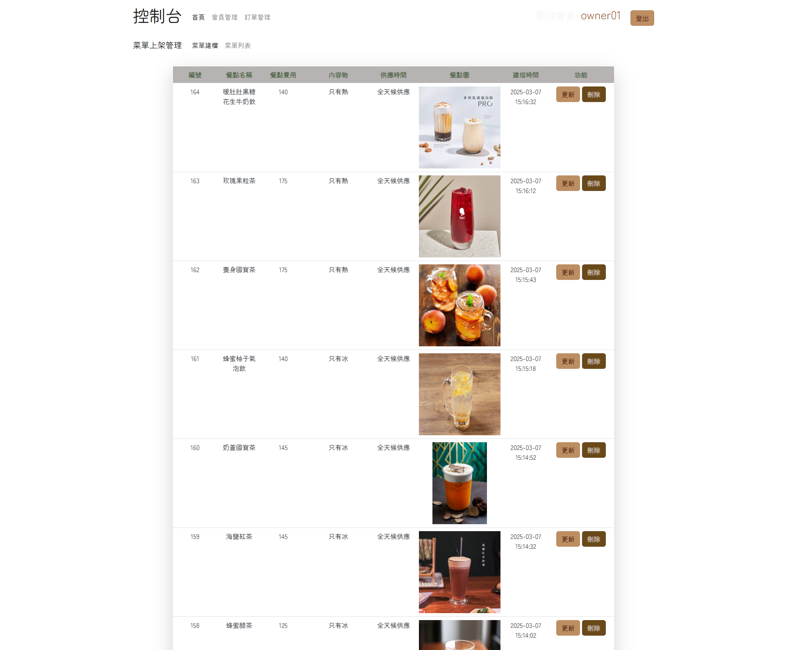

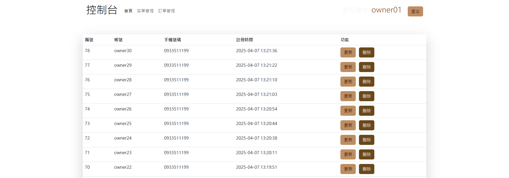

 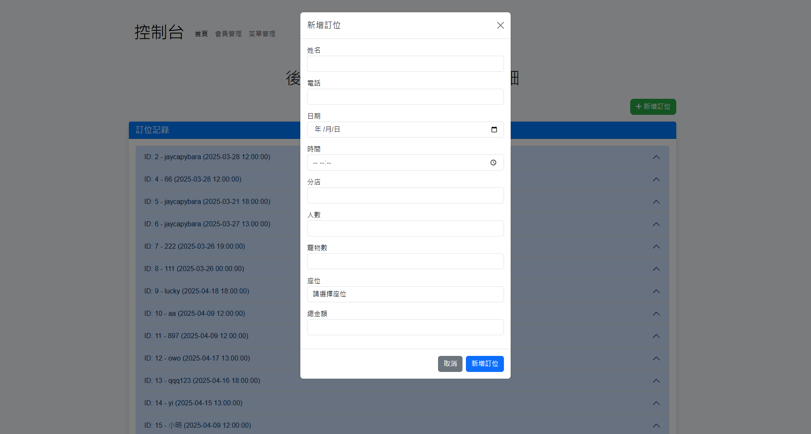

 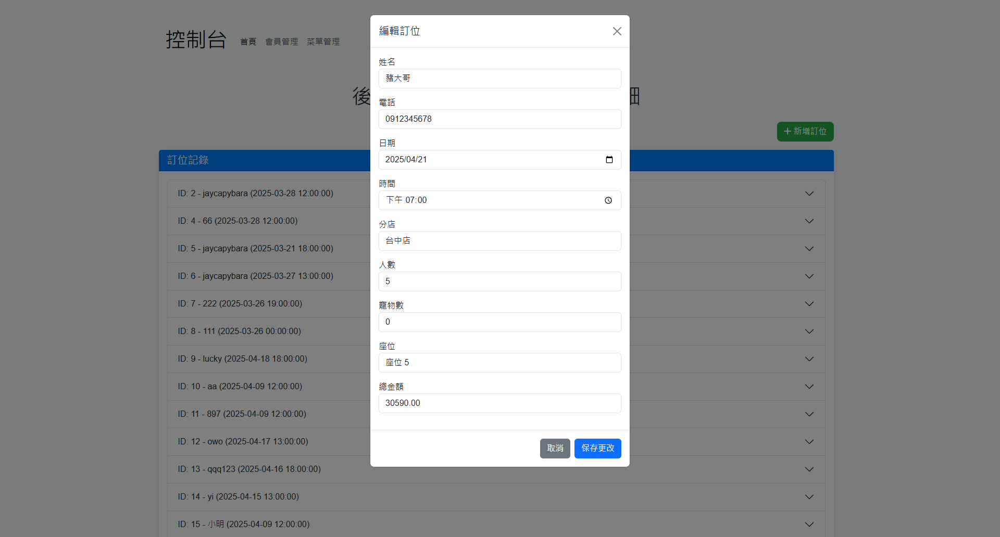

 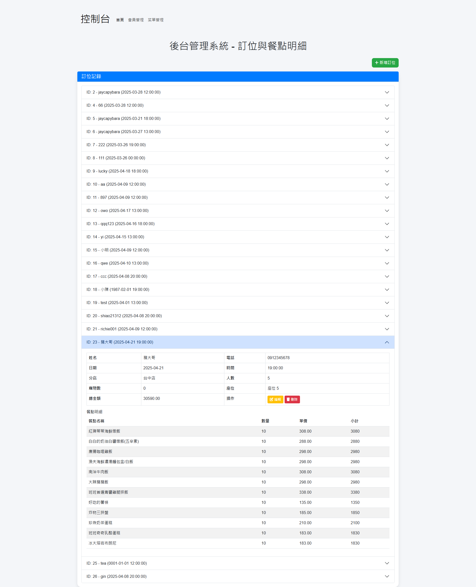

 
  <h2>不用連絡我專線</h2> 控八控控 092控控控
  
 
      
